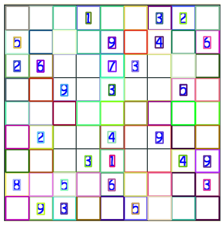
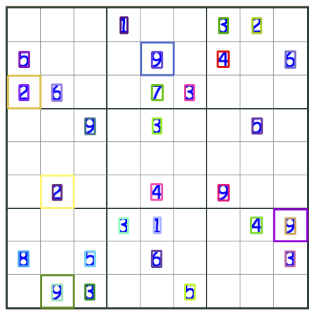
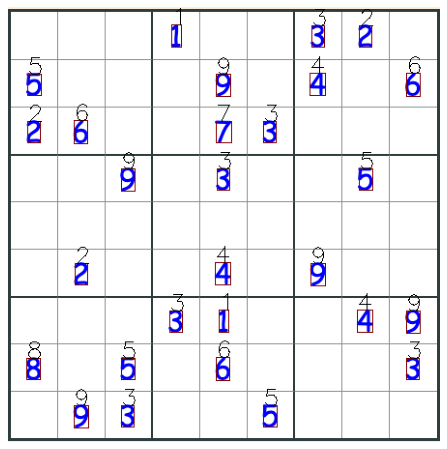
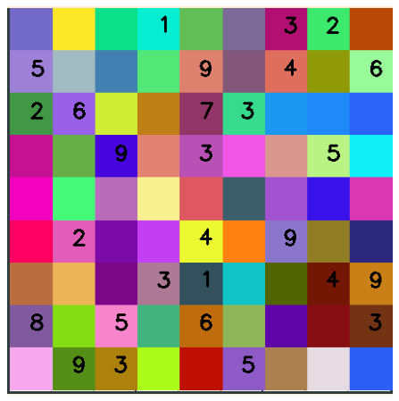
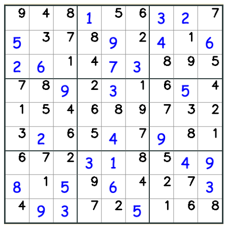

# CV based Sudoku-solver

## Steps:
1. Load the image  
  
2. get regional proposals from [MSER algorithm](https://en.wikipedia.org/wiki/Maximally_stable_extremal_regions)  

3. Detect whether digits or not in regional proposals  

4. Remove overlapped bounding boxes and classify digits  

5. Translate bounding boxes and digits into 'sudoku'  

6. Solve the sudoku (backtrack algorithm)  

7. Draw back on the image  
  

## Installation

## TODO
