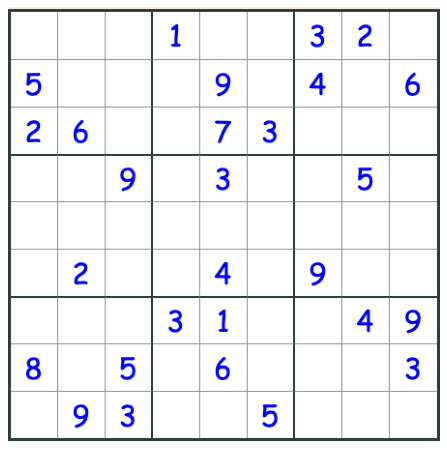

# CV based Sudoku-solver(generator: to be added)  / 基于计算机视觉技术的数独解答器（生成器待添加）
---
Sudoku solving algorithm is quite common - a classic programming problem(e.g. [Sudoku Solver](https://leetcode.com/problems/sudoku-solver/)). 
It would be much more interesting to use Computer vision technique to solve a sudoku in an image, which can be seen as an **Object detection** problem.
This repo implements two CNN-based models plus other functionalities to achieve this challenge:  
- By using [SVHN dataset](http://ufldl.stanford.edu/housenumbers/), train **digit-detector** and **digit-classifier** models from scratch.   
- Translate the bounding boxes and digits from the models into a 'sudoku'.  
- Solve the soduku and draw the solution back on the image.  

## Example:
1. Load the image  
  
2. get regional proposals from [MSER algorithm](https://en.wikipedia.org/wiki/Maximally_stable_extremal_regions)  

3. Detect whether digits or not in regional proposals  

4. Remove overlapped bounding boxes and classify digits  

5. Translate bounding boxes and digits into 'sudoku'  

6. Solve the sudoku (backtrack algorithm)  

7. Draw back on the image  
  

## Installation

Clone this repo:
`git clone https://github.com/ZequnZ/Sudoku-generator-solver.git`  
### Dependency management
`pyenv` + `poetry`

Install [pyenv](https://github.com/pyenv/pyenv#choosing-the-python-version):  
```
curl -L https://raw.githubusercontent.com/yyuu/pyenv-installer/master/bin/pyenv-installer | bash
```  

Modify env variable:  
```
export PATH="<.pyenv path>/bin:$PATH"
```

Install  *python3.8.2*:  
```
pyenv install 3.8.2
```

Intall and ctivate virtual env:  
```
pyenv virtualenv 3.8.2 sudoku382
```  
```
pyenv activate sudoku382
```

Install [poetry](https://python-poetry.org/)
```
pip install poetry
```

Install dependency:  
```
poetry install
```


TODO: docker support

## TODO
